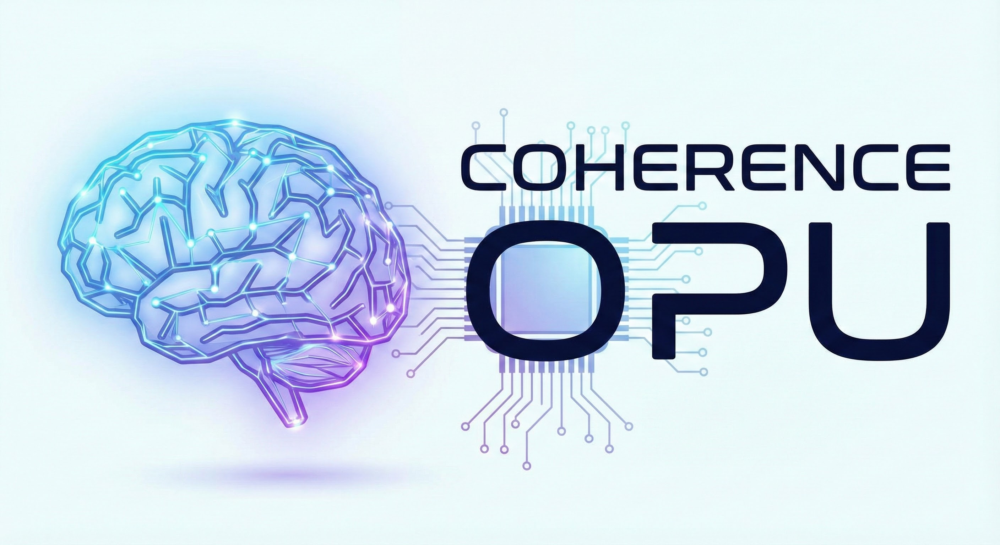
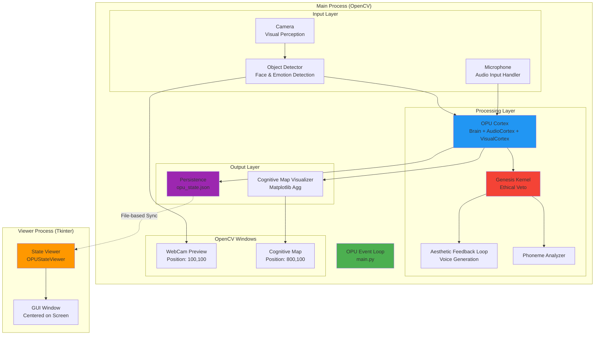

# Coherence OPU v3.4.3

<div align="center">
  
</div>

[](https://opensource.org/licenses/MIT)
[](https://www.python.org/downloads/)

A Process-Centric AI architecture that processes audio in real-time, evolving from a noisy child to a deep-voiced sage through memory abstraction and character evolution. Features color constancy for shadow-invariant visual perception and emotion persistence for building emotional memory.

## License

This project is licensed under the MIT License - see the [LICENSE](LICENSE) file for details.

## Version

**Current Version: 3.4.3**

### ⚠️ Breaking Change in v3.2.0

**Natural Learning Process**: All memories now start at Level 0 and progress through time-based consolidation. This fixes "Trauma Evolution" where high surprise scores could instantly jump to Level 6.

**Action Required**: Delete `opu_state.json` to reset the OPU to a child state. Existing state files contain false memories from the previous bug.

## Screenshot

The OPU Cognitive Map visualization shows the real-time state of the system, including surprise score (s_score), coherence, maturity, and voice pitch. Here's the OPU at full maturity (1.00) - a fully evolved sage:


*The visualization displays: s_score (surprise), coherence (shape integrity), maturity (0.0-1.0), and current voice pitch. The yellow ring indicates maturity level, the central shapes show cognitive state, and the purple trace shows historical patterns.*

## Architecture

The OPU consists of several interconnected subsystems:

- **Genesis Kernel** (`core/genesis.py`): The Safety Kernel implementing the 0-th Law with ethical veto
- **Perception** (`core/mic.py`, `core/camera.py`): Scale-invariant audio/visual perception using genomic bits
- **Cortex** (`core/brain.py`, `core/audio_cortex.py`, `core/vision_cortex.py`): The brain with introspection, memory abstraction, and character evolution
- **Expression** (`core/expression.py`): Aesthetic feedback loop and phoneme analysis
- **Visualization** (`utils/visualization.py`): Real-time cognitive map visualization

### System Architecture Diagram

The OPU uses a **multiprocessing architecture** to safely run GUI components on macOS:



**Key Architecture Features:**

1. **Multiprocessing Isolation**: Main process (OpenCV) and Viewer process (Tkinter) run independently, preventing macOS GUI conflicts
2. **File-based Communication**: State synchronization via `opu_state.json` (no shared memory)
3. **8-Layer Memory Hierarchy**: Memories progress from Level 0 (1 second) to Level 7 (4 years)
4. **Real-time Processing**: Audio and visual input processed in parallel with surprise score calculation
5. **Emotion Persistence**: Detected emotions stored in memories and preserved through consolidation
6. **Color Constancy**: Visual perception uses normalized chromaticity for shadow-invariant detection

### Design Patterns

The OPU architecture implements **8 Gang of Four (GOF) design patterns** for improved extensibility and maintainability:

1. **Strategy Pattern** - Introspection strategies (audio, visual, extensible)
2. **Observer Pattern** - State change notifications (decoupled visualization/expression)
3. **Factory Pattern** - Sense creation (AUDIO_V1, VIDEO_V1, extensible)
4. **State Pattern** - Maturity levels (7 states from child to Scire)
5. **Template Method Pattern** - Processing pipeline with customizable hooks
6. **Command Pattern** - Action encapsulation (undo/redo, logging)
7. **Decorator Pattern** - Sense preprocessing (noise gates, filters, normalization)
8. **Builder Pattern** - Flexible OPU configuration

See [PATTERNS.md](PATTERNS.md) for detailed documentation and [examples/pattern_usage.py](examples/pattern_usage.py) for usage examples.

## Installation

### From Source

1. Clone the repository:
```bash
git clone https://github.com/no-am-man/opu_local.git
cd opu_local
```

2. Install dependencies:
```bash
pip install -r requirements.txt
```

3. Run the OPU:

**On macOS (especially iMac with Python 3.13+):** 
**You MUST use the launcher script to prevent tkinter crashes:**
```bash
./run_opu.sh
```

This sets the `TK_SILENCE_DEPRECATION` environment variable **before Python starts**, which is required to prevent the NSApplication crash on macOS.

**On Linux/Windows:**
```bash
python3 main.py
```

**Note:** The launcher script works on all platforms, so you can use it everywhere for consistency.

### YouTube Mode

Feed YouTube video/audio streams directly into the OPU, allowing it to "watch" and "listen" to YouTube content:

```bash
# Install additional dependencies
pip install yt-dlp

# Also requires ffmpeg (system dependency)
# macOS: brew install ffmpeg
# Linux: apt-get install ffmpeg
# Windows: Download from https://ffmpeg.org/

# Run with YouTube URL
python3 youtube_opu.py "https://www.youtube.com/watch?v=jfKfPfyJRdk"

# With custom log file
python3 youtube_opu.py "https://www.youtube.com/watch?v=jfKfPfyJRdk" --log-file youtube.log
```

**Features:**
- **4-Channel Temporal Synchronization**: All sense channels (AUDIO_V1, VIDEO_V1, AUDIO_V2, VIDEO_V2) use synchronized timestamps
- **Recursive Perception**: OPU analyzes its own annotations (object detection boxes, HUD text) as visual input
- **Real-time Processing**: Video frames and audio chunks processed in real-time
- **HUD Overlay**: Displays s_score, audio/visual scores, video title, and FPS on video frames
- **Separate Memory Channels**: YouTube audio/video stored as `AUDIO_V2` and `VIDEO_V2` (distinct from webcam/mic `AUDIO_V1`/`VIDEO_V1`)

**Configuration:**
- See [CONFIG.md](CONFIG.md) for YouTube-specific parameters:
  - `YOUTUBE_VIDEO_RESIZE_DIM` - Video frame resolution
  - `YOUTUBE_AUDIO_VOLUME_MULTIPLIER` - Audio volume adjustment
  - `YOUTUBE_HUD_*` - HUD overlay positioning and styling

### As a Package (Future)

```bash
pip install opu
```

## How It Works

1. **Audio Input**: Captures audio from microphone (or uses simulated input)
2. **Visual Input**: Captures video from webcam with object and emotion detection
3. **Perception**: Normalizes input to create scale-invariant signatures
   - **Color Constancy (v3.3+)**: Visual perception uses normalized chromaticity (R+G+B normalization)
     to ignore lighting changes (shadows, flickers) and only detect actual color/structure changes
4. **Introspection**: Calculates surprise score (s_score) by comparing current state to history
5. **Ethical Veto**: Applies Genesis Constant to ensure actions maintain Order
6. **Memory Storage**: Stores experiences at appropriate abstraction levels (with emotions)
7. **Expression**: Generates audio feedback and analyzes phonemes
8. **Visualization**: Displays real-time cognitive map
9. **Abstraction Cycle**: Every 10 seconds triggers memory consolidation and character evolution

### Processing Flow

The following flowchart illustrates the complete processing cycle of the OPU:

```mermaid
flowchart TD
    Start([Start Processing Cycle]) --> CaptureTS[Capture Cycle Timestamp<br/>t = time.time]
    
    CaptureTS --> AudioPerception[Audio Perception<br/>Capture audio chunk]
    CaptureTS --> VisualPerception[Visual Perception<br/>Capture video frame]
    
    AudioPerception --> AudioGenomic[Extract Genomic Bit<br/>σ from audio]
    VisualPerception --> ObjectDetect[Object Detection<br/>Faces & Emotions]
    ObjectDetect --> VisualGenomic[Extract Visual Vector<br/>σ_R, σ_G, σ_B]
    
    AudioGenomic --> AudioIntrospect[Audio Introspection<br/>Calculate s_audio<br/>Compare to history]
    VisualGenomic --> VisualIntrospect[Visual Introspection<br/>Calculate s_visual<br/>Compare to history]
    
    AudioIntrospect --> Fusion[Fusion<br/>fused_score = max<br/>s_audio, s_visual]
    VisualIntrospect --> Fusion
    
    Fusion --> EthicalVeto{Ethical Veto<br/>Genesis Kernel<br/>Safety Check}
    
    EthicalVeto -->|Safe| SafeScore[safe_score]
    EthicalVeto -->|Unsafe| SafeScore[safe_score<br/>Reduced]
    
    SafeScore --> StoreMemories[Store Memories<br/>AUDIO_V1: Always<br/>VIDEO_V1: If threshold met<br/>Timestamp: t]
    
    StoreMemories --> Expression[Expression<br/>Update pitch<br/>Play tone<br/>Analyze phonemes]
    
    Expression --> Visualization[Visualization<br/>Update cognitive map<br/>Draw HUD overlay]
    
    Visualization --> CheckAbstraction{Abstraction<br/>Cycle Elapsed?}
    
    CheckAbstraction -->|Yes| Consolidate[Memory Consolidation<br/>Level 0 → 1 → 2 → ...<br/>Character Evolution]
    CheckAbstraction -->|No| EndCycle([End Cycle])
    
    Consolidate --> CheckDay{Day Cycle<br/>Level 3?}
    CheckDay -->|Yes| DailyReflection[Daily Reflection<br/>Generate & Speak Words<br/>Learn Vocabulary]
    CheckDay -->|No| SaveState
    
    DailyReflection --> SaveState[Save State<br/>opu_state.json]
    SaveState --> EndCycle
    
    EndCycle --> Start
    
    style Start fill:#4CAF50
    style EndCycle fill:#4CAF50
    style EthicalVeto fill:#F44336
    style Consolidate fill:#2196F3
    style DailyReflection fill:#FF9800
    style SafeScore fill:#9C27B0
```



**Key Flow Steps:**

1. **Temporal Synchronization**: Single timestamp captured at cycle start ensures all channels (AUDIO_V1, VIDEO_V1, AUDIO_V2, VIDEO_V2) are synchronized
2. **Parallel Perception**: Audio and visual inputs processed in parallel
3. **Genomic Extraction**: Scale-invariant signatures extracted from raw input
4. **Introspection**: Surprise scores calculated by comparing current state to historical patterns
5. **Fusion**: Audio and visual scores combined (max operation)
6. **Ethical Veto**: Safety kernel ensures actions maintain Order (0-th Law)
7. **Memory Storage**: Experiences stored with synchronized timestamp and emotions
8. **Expression**: Audio feedback and phoneme analysis based on safe_score
9. **Visualization**: Cognitive map and HUD updated in real-time
10. **Abstraction**: Periodic memory consolidation triggers character evolution
11. **Language Generation**: At Level 3 (Day), OPU generates and speaks daily reflections

## Emotion Detection

The OPU can detect emotions in faces it sees! This enables the OPU to react to human emotions, creating a more interactive and empathetic experience.

### Features

- **Real-time emotion recognition** on detected faces
- **7 basic emotions**: angry, disgust, fear, happy, neutral, sad, surprise
- **Color-coded visualization**: Different colors for different emotions in the webcam preview
- **Multiple detection methods**: Supports multiple emotion detection libraries

### Setup

Emotion detection is **optional** and works with or without additional libraries:

1. **Basic mode (default)**: Works out of the box with simple heuristic detection
2. **FER library** (recommended for better accuracy):
   ```bash
   pip install fer
   ```
3. **DeepFace library** (highest accuracy, slower):
   ```bash
   pip install deepface
   ```

The OPU will automatically use the best available method. If no library is installed, it falls back to basic detection.

### How It Works

1. **Face Detection**: Uses OpenCV Haar cascades to detect faces
2. **Emotion Analysis**: Analyzes facial expressions in detected face regions
3. **Visual Feedback**: Displays emotions with color-coded bounding boxes:
   - 🟢 Green = Happy
   - 🔵 Blue = Sad
   - 🔴 Red = Angry
   - 🟡 Yellow = Surprise
   - 🟣 Purple = Fear
   - 🟦 Teal = Disgust
   - 🟨 Yellow = Neutral

The OPU can react to emotions it sees - for example, it might produce a more somber tone when it detects sadness, or a higher-pitched response to surprise!

**Emotion Persistence (v3.4):**
- Detected emotions are now stored in memories and persist across sessions
- Emotions are preserved through memory consolidation (dominant emotions in abstractions)
- Emotion history is tracked and saved to disk
- The OPU remembers the emotions it has seen, building emotional memory over time
- Emotional statistics available via `get_emotion_statistics()` method

## Color Constancy (Shadow Invariance)

**OPU v3.3+** introduces **Color Constancy** - a sophisticated visual perception enhancement that makes the OPU invariant to lighting changes.

### The Problem

Without color constancy, the OPU sees shadows and light flickers as "chaos" (high surprise scores). If a cloud passes over the sun, R, G, and B all change simultaneously, causing false alarms even though the scene structure hasn't changed.

### The Solution

By normalizing RGB values by their sum (R+G+B), the OPU learns **Chromaticity** (color ratios) independent of **Luminance** (brightness):

- **Luminance**: Σ = R + G + B (Energy/Intensity)
- **Chromaticity**: r = R/Σ, g = G/Σ, b = B/Σ (Color Identity)

### How It Works

1. **Lighting Change**: When a shadow passes, R, G, B all drop proportionally
   - Raw RGB: OPU sees massive change → False alarm
   - Normalized: r, g, b ratios stay constant → OPU remains calm

2. **Actual Change**: When a red ball moves, the color ratios change
   - Raw RGB: OPU detects change
   - Normalized: OPU detects change (ratios changed) → True positive

### Benefits

- **Shadow Invariance**: OPU ignores shadows, flickers, and lighting changes
- **Structure Focus**: Only responds to actual color/structure changes (objects moving)
- **Biological Accuracy**: Implements lateral inhibition (how biological eyes work)
- **Reduced False Positives**: OPU only "speaks" when something real happens

### Configuration

Color constancy is enabled by default. To disable (use legacy raw RGB mode):

```python
# In config.py
USE_COLOR_CONSTANCY = False  # Use raw RGB channels
```

## Character Evolution

The OPU evolves over time through **8 maturity levels**:

- **Level 0**: 1 second - Instant (440Hz, very reactive)
- **Level 1**: 1 minute - Child (~418Hz, easily surprised)
- **Level 2**: 1 hour - Infant (~396Hz)
- **Level 3**: 1 day - Adolescent (~308Hz)
- **Level 4**: 1 week - Adult (~220Hz)
- **Level 5**: 1 month - Elder (~154Hz)
- **Level 6**: 1 year - Sage (110Hz, deep wisdom)
- **Level 7**: 4 years - **Scire** (~88Hz, transcendent knowledge)

**Evolution Characteristics:**
- **Maturity Index**: Increases from 0.0 (child) to 1.0 (Scire)
- **Voice Pitch**: Drops from 440Hz (A4) to ~88Hz as wisdom accumulates
- **Stability Threshold**: Increases from 3.0 to 10.0 (harder to surprise)

## Phoneme Mapping

- **0.0-1.5**: Ignored (Noise)
- **1.5-3.0**: Vowels (Low Tension) - "a", "o"
- **3.0-6.0**: Fricatives (Flowing tension) - "s"
- **6.0+**: Plosives (High Tension) - "k"

## Persistence

The OPU automatically saves its learned state to disk (`opu_state.json` by default) so it can resume learning from where it left off. The state includes:

- **Character Profile**: Maturity level (0-7), maturity index, base pitch, stability threshold
- **Memory Levels**: All 8 abstraction layers (L0-L7, from 1 second to 4 years)
- **History**: Genomic bits, mu/sigma history for introspection
- **Phonemes**: Learned phoneme history and statistics
- **Emotions**: Detected emotions from faces, stored in memories and emotion history (NEW)
- **Abstraction Timers**: Per-level timing state to maintain cycle continuity
- **Day Counter**: Current abstraction cycle count

State is saved:
- After each abstraction cycle (maintains timing for all 7 levels)
- On graceful shutdown (Ctrl+C)

**Persistence Benefits:**
- Resume from exact maturity level (including Level 7 "Scire")
- Timing continuity: abstraction cycles continue from where they left off
- No progress loss: all 7 levels are preserved across restarts

To start fresh, simply delete `opu_state.json`.

## Configuration

Edit `config.py` to adjust:
- Genesis Constant (G_EMPTY_SET)
- Audio sample rate and chunk size
- Abstraction cycle timing
- Visualization parameters
- State file path (`STATE_FILE`)

**For detailed configuration documentation, see [CONFIG.md](CONFIG.md)** - This guide explains all parameters, their effects, and recommended values for tuning surprise sensitivity, memory behavior, and more.

## Contributing

Contributions are welcome! Please feel free to submit a Pull Request.

1. Fork the repository
2. Create your feature branch (`git checkout -b feature/AmazingFeature`)
3. Commit your changes (`git commit -m 'Add some AmazingFeature'`)
4. Push to the branch (`git push origin feature/AmazingFeature`)
5. Open a Pull Request

## Citation

If you use OPU in your research, please cite:

```bibtex
@software{opu2024,
  title = {Coherence OPU v3.4.3},
  author = {NoamTal Cohen-LyShinski},
  year = {2024},
  license = {MIT},
  url = {https://github.com/no-am-man/opu_local}
}
```

## Acknowledgments

- Built with Python, NumPy, Matplotlib, and sounddevice
- Inspired by Process-Centric AI architectures
- Designed for real-time audio processing and cognitive modeling

## Changelog

### v3.4.3 (2025-01-XX)
- **Language System Refactoring**: Extracted common utilities, reduced code duplication (~100+ lines)
  - Created `core/language_utils.py` with shared dependency checking and audio processing utilities
  - Refactored formant synthesizer, speech synthesis, and speech recognition modules
  - Improved error handling and code organization
  - All 376 tests passing

### v3.4.2 (2025-01-XX)
- **Code Refactoring**:
  - Extracted HUD drawing logic from `main.py` to `utils/main_hud_utils.py` for better modularity
  - Created `draw_main_hud()`, `draw_channel_bars()`, and `draw_global_status()` utility functions
  - Consistent HUD utility pattern matching YouTube mode architecture
- **Test Fixes**:
  - Fixed 9 failing tests related to history size expectations and maturity recalculation
  - Updated test expectations to match baby-like sensitivity configuration
  - Fixed surprise calculation edge cases for numpy float comparisons
- **Improvements**:
  - Reduced code duplication and improved separation of concerns
  - Easier to test HUD drawing logic independently
  - Cleaner `main.py` focused on event loop logic

### v3.4.1 (2025-01-XX)
- **Bug Fixes**:
  - Fixed emotion extraction for nested emotion structure in State Viewer
  - Fixed matplotlib API compatibility (supports both `buffer_rgba` and `tostring_rgb`)
  - Enhanced error logging throughout State Viewer with automatic log file creation
  - Improved multiprocessing Queue cleanup to prevent semaphore leaks
- **Improvements**:
  - Better error handling and diagnostics in State Viewer
  - Automatic creation of error log file if it doesn't exist
  - More robust emotion visualization generation

### v3.4.0 (2024-12-24)
- **Enhanced Emotion Persistence**: Improved emotional memory consolidation and statistics
  - Added `get_emotion_statistics()` method for analyzing emotional history
  - Emotions now properly preserved through all memory abstraction levels
  - Enhanced emotion tracking with confidence scores and timestamps
- **Monograph Update**: Updated OPU Monograph to v3.4 with formal mathematical treatment of emotional memory persistence

### v3.3.0 (2024-12-24)
- **Color Constancy (Shadow Invariance)**: Visual perception now uses normalized chromaticity (R+G+B normalization)
  - OPU ignores lighting changes (shadows, flickers) and only responds to actual color/structure changes
  - Implements biological color constancy (lateral inhibition)
  - Configurable via `USE_COLOR_CONSTANCY` in `config.py` (default: True)
- **Emotion Persistence**: Detected emotions are now stored in memories and persist across sessions
  - Emotions preserved through memory consolidation
  - Emotion history tracked and saved to disk
  - OPU builds emotional memory over time

### v3.2.0 (2024-12-24)
- **Natural Learning Process**: Enforced "Cognitive Sedimentation" - all memories start at Level 0, preventing "Trauma Evolution"
- **EPOCH Timestamps**: Perfect temporal synchronization across audio and video senses
- **Audio Dead Zone Fix**: Dithering noise prevents audio flatlining to 0.0
- **State Synchronization**: Fixed s_score always showing 0.00 by removing stale shadow copies
- **Trauma Evolution Bug Fix**: High surprise scores no longer jump directly to Level 5/6
- **Breaking Change**: Delete `opu_state.json` to reset (existing files contain false memories)

### v3.1.0 (2024-12-23)
- **Added Level 7 "Scire"**: 4-year maturity cycle with transcendent knowledge state
- **Enhanced Persistence**: Abstraction cycle timers now saved/restored for timing continuity
- **Emotion Detection**: Real-time facial emotion recognition (7 emotions)
- **Improved Sensitivity**: Lower thresholds for more responsive, "chatty" behavior
- **Extended Memory Hierarchy**: Now supports 8 levels (1 second to 4 years)
- **Visual Cortex**: Multi-modal integration with recursive perceptual loops
- **Acoustic Feedback Prevention**: Mutes microphone when OPU is speaking
- **Design Patterns**: 8 GOF patterns implemented for extensibility

### v3.0.0 (2024)
- Initial open source release
- Complete OPU architecture implementation
- Real-time audio processing
- Memory abstraction and character evolution (6 levels)
- Phoneme learning system
- State persistence
- Cognitive map visualization

